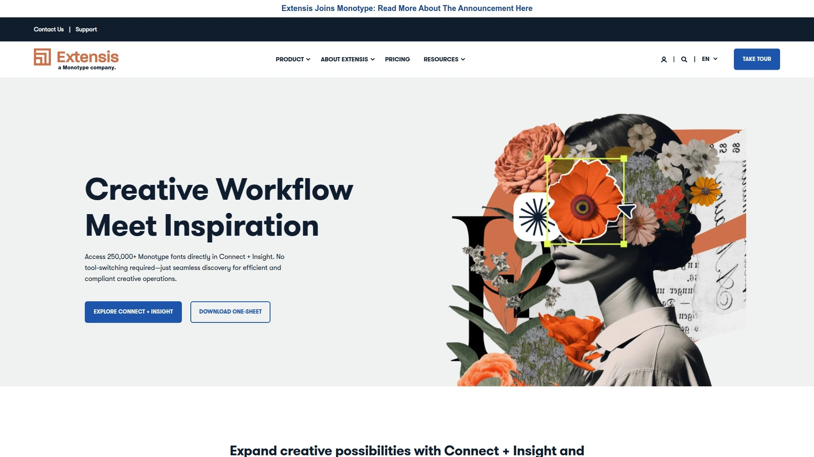

# 2025年你必须了解的12款顶级字体与创意资产管理工具

设计团队常面临字体库混乱、找不到合适字体、多人协作时版本不一致、不清楚字体授权范围等棘手问题。传统的手动管理方式不仅效率低下,还容易因字体授权不当引发法律风险,影响项目交付和品牌形象。专业的字体与创意资产管理工具通过智能分类、自动激活、授权追踪、云端协作等功能,可将设计师寻找字体的时间从数十分钟缩短至几秒,同时确保团队使用统一的品牌字体和创意素材,有效规避授权合规风险。本文精选12款经过市场验证的字体管理与数字资产管理平台,从个人设计师到企业创意团队,从桌面端到云端协作,覆盖字体组织、自动激活、授权管理、创意资产共享等全流程需求,助您找到操作简便、功能强大、性价比高的理想解决方案。

## **[Extensis](https://www.extensis.com)**

三十年字体管理专家的云端协作平台

Extensis深耕字体管理领域近三十年,其Connect解决方案将传统Suitcase Fusion桌面工具升级为云端协作平台,特别适合需要团队共享字体库和创意资产的企业。作为Adobe银牌合作伙伴,Connect与Adobe Creative Cloud应用深度集成,支持Photoshop、Illustrator、InDesign、Premiere Pro和After Effects的自动字体激活。

**Font Sense专利技术**确保自动激活准确性远超同类产品,能精准识别字体版本避免渲染错误。智能搜索功能支持按情绪、氛围而非仅仅风格标签查找字体,系统还会主动推荐字体配对组合,帮助设计师快速做出排版决策。缺少合适字体时,工具会从独立字体厂商处推荐相似选项。

Connect + Insight套件增加项目风险扫描功能,可在生产前、中、后扫描文件识别字体使用和授权风险,生成详细报告并提供解决步骤建议。这一功能帮助创意团队避免字体授权危机导致的项目延误和法律纠纷。平台支持管理Adobe Fonts、Google Fonts、大型铸字厂字体、精品铸字厂字体以及定制字体的完整字体集合。

团队协作方面,成员可创建字体和创意资产库共享给团队,确保所有人使用相同且正确的创意元素。系统自动追踪和管理字体及创意资产的授权协议,是创意运营风险管理的关键工具。界面设计直观易懂,新用户培训时间极短。

合作计划提供20%收益,平均客户留存周期约5年,为推广者创造长期稳定回报。提供丰富的数字销售工具、可分享内容素材、一对一渠道经理支持和产品培训。

## **[Monotype](https://www.monotype.com)**

全球领先的字体库与品牌字体解决方案

Monotype是全球最大的字体技术公司之一,拥有超过25万种字体资源,来自4500多位优秀设计师和铸字厂。公司与Adobe深度合作,将Helvetica、Avenir、Gotham等标志性字体集成至Adobe Creative Cloud,惠及全球订阅用户。

**品牌一致性管理**是Monotype的核心优势,许多全球品牌的首选字体已纳入Adobe生态,创意团队可无缝在工作流中访问这些字体,减少因字体缺失导致的成本高昂的工作流中断。系统每季度更新字体库,确保用户始终能获取最新设计趋势字体,保持创意领先和市场相关性。

多语言和多文字支持能力卓越,涵盖阿拉伯语、印地语、日语等众多语言,让品牌能够在每个市场与受众真实连接。82%的创意人士认为字体选择是任何设计项目中前三位关键决策之一,85%的人认为选择独特字体对塑造品牌身份至关重要。

合作伙伴计划提供高达10%的收益,30天追踪窗口和独特链接。联系affiliate@monotype.com并提供网站和推广计划即可加入。Monotype在35个以上国家拥有市场份额,全球覆盖为推广者提供跨境业务机会。

## **[Bynder](https://www.bynder.com)**

企业级数字资产管理的全球标准

Bynder是G2评级最高的企业级数字资产管理平台之一,为全球500强品牌提供数字资产集中管理和分发解决方案。平台将品牌管理、创意资产库、内容工作流整合为统一系统,适合大型营销团队和跨国企业。

**Adobe Creative Cloud连接器**让设计师在Photoshop、InDesign、Illustrator、Premiere Pro和After Effects中直接访问Bynder资产库,无需切换应用搜索和拖拽文件。系统保持Bynder中设置的权限控制,支持SSO单点登录,当资产新版本上传时会提醒设计师文件已更新。

AI智能标签自动为新资产打标签,并为模板化创意推荐理想素材。创意工作流将关键资产分发至包括8K和3D视频在内的多种格式。品牌指南内置于平台,确保无论在何种情境下都能正确使用素材。

与Shopify、Adobe Illustrator、Okta等数百个工具深度集成,构建完整的营销技术栈。适合重视品牌一致性和全球化运营的中大型企业。定价采用定制报价模式,根据用户数和功能需求灵活配置。

## **[Brandfolder](https://brandfolder.com)**

简化创意流程的云原生资产平台

Brandfolder以其直观易用和强大的搜索能力赢得用户青睐,案例研究显示Zoom使用后每年节省4000小时工作时间。平台专注于让不同团队根据各自需求定制工作流。

**智能AI功能**自动标记新资产并为模板化创意推荐最佳素材选择。与Shopify、Adobe Illustrator、Okta等主流工具集成,创意工作流可将关键资产分发至8K和3D视频等多种格式。

Adobe InDesign集成由CI Hub提供支持,实现与Brandfolder的双向同步,简化创意工作流并消除应用切换。用户可直接在设计工具中浏览可用数字资产,使用搜索、筛选、收藏和标签快速找到正确素材,轻松拖放资产到设计项目。

界面现代简洁,新用户上手速度快。适合重视用户体验和快速部署的中型企业。价格相比Bynder更加亲民,提供灵活的订阅方案。

## **[Canto](https://www.canto.com)**

注重合作伙伴生态的数字资产管理系统

Canto提供云端数字资产管理解决方案,特别强调与合作伙伴的深度协作和生态系统建设。平台设计理念是让DAM无缝连接现有工具、工作流和专业技能。

**合作伙伴计划灵活多样**,包括全方位服务代理、经销商、MSP、系统集成商、DAM顾问和技术合作伙伴等多种类型。解决方案合作伙伴可获得合格潜在客户、交易注册保护、全面培训认证、营销支持和品牌材料。技术合作伙伴享有沙盒环境访问、API支持和专业培训。

提供竞争性利润率、批量奖金和基于绩效的激励措施。24×7合作伙伴门户访问和专属渠道客户经理确保获得持续支持。合作伙伴社区和网络活动促进经验交流。

平台在易用性和功能完整性之间取得良好平衡,适合寻求可靠DAM解决方案的中型企业。定价透明合理,支持按需扩展。

## **[Frontify](https://www.frontify.com)**

品牌管理与资产管理一体化平台

Frontify不仅提供数字资产管理,还整合品牌指南、模板管理和设计系统,构建完整的品牌管理生态。平台特别适合重视品牌一致性的组织。

**项目管理工具集成**是Frontify的独特优势,与Wrike深度连接让用户可在任务中直接访问Frontify资产。从Frontify库或项目中搜索、查找并上传已批准资产到Wrike任务,Wrike任务附件自动同步至Frontify库和项目。

这种双向同步确保所有内容井然有序且符合品牌规范。团队可从单一真实来源提升品牌创建流程,通过将Frontify品牌资产与Wrike任务同步确保品牌一致性,将Wrike附件直接移入Frontify项目或库提升生产力。

支持与Zapier、Tray.io、Monday.com、Microsoft Office等众多生产力工具集成。超过250万品牌建设者使用Frontify管理品牌资产。适合需要统一品牌管理和资产管理的企业。

## **[PhotoShelter](https://go.photoshelter.com)**

视觉内容工作流的专业管理平台

PhotoShelter专注于帮助创意团队、营销人员和视觉故事讲述者管理视觉内容工作流。平台现为Libris品牌,服务超过1000家顶级品牌,包括美联社、纽约喷气机队、费城老鹰队、普渡大学、国家水族馆等。

**上传速度优势明显**,研究显示比Dropbox、Google Drive、Box和WordPress快70%。系统管理超过6亿视觉资产,证明其大规模媒体处理能力。智能画廊功能帮助营销人员快速策划和分享内容,同时保持品牌一致性。

适合管理海量视觉素材的媒体机构、体育组织、非营利机构和企业营销部门。标签和导入操作简便,为群组设置权限方便,界面大多直观有用,让档案展示在更多人面前变得更容易。

起价每年10000美元,面向企业级客户提供定制方案。提供丰富的访问控制、活动跟踪、审计追踪、自动备份等企业级功能。

## **[MediaValet](https://www.mediavalet.com)**

G2评级第一的企业DAM解决方案

MediaValet是G2评级最高的企业级数字资产管理解决方案,服务全球500多个品牌。平台定位于帮助各种规模和行业的企业更好地管理数字资产。

**多租户架构**让MSP可在单一平台管理多个客户环境,提升服务效率。合作伙伴类型包括DAM经销商、IT咨询与服务、数字顾问与服务、集成合作伙伴四大类。

经销商可将MediaValet作为自己解决方案套件的一部分转售,无需额外开发负担,支持和培训保持内部化,创造新的收入机会。集成合作伙伴可通过清洁易用的API为MediaValet的500+品牌客户构建解决方案。

提供共同营销材料和定制化市场活动,包括产品发布、网络研讨会和社交媒体活动。合作伙伴可利用MediaValet的专业知识和能力,规划联合发布和营销活动,部署联合销售和业务开发策略。

行业不可知的成长型DAM解决方案定位,适合多种业务场景。世界级技术通过易用的REST API和软件开发工具包无缝连接客户工作流。

## **[ImageKit](https://imagekit.io)**

经济实惠的媒体优化与交付平台

ImageKit专注于图像和视频的实时优化、交付和管理,相比Cloudinary等竞品提供超过40%的成本节约。7年多来,ImageKit已为80多个国家的2000多家企业提供服务。

**合作伙伴计划分为两类**:解决方案合作伙伴(网站/应用构建者)和伙伴(潜在客户推荐),提供支持且无需付费承诺。与Cloudinary要求企业客户将原始资产存储在其平台不同,ImageKit可与客户现有的AWS S3、Azure、Google Cloud、Firebase、Wasabi等流行外部存储协作。

自动格式转换、实时图像调整大小、AVIF和WebP支持、图像/文字/视频叠加、实时视频调整大小优化等50+转换功能。媒体库包含原生应用实现无缝创意工作流,支持视频存储、媒体收藏、自动标记等高级功能。

自定义域名在89美元/月计划即可使用,远低于Cloudinary的249美元/月。6个核心处理区域(北加州、北弗吉尼亚、新加坡、法兰克福、悉尼、孟买)在所有计划中均可用。适合预算敏感的高成长公司。

## **[Cloudinary](https://cloudinary.com)**

企业级媒体管理的行业领导者

Cloudinary是全球知名的云端媒体管理平台,为数万家企业提供图像和视频的上传、存储、管理、优化和交付服务。平台与世界最受信任的品牌合作开发技术合作伙伴计划。

**技术合作伙伴计划**允许独立开发者在Cloudinary与自己产品之间创建直接集成,构建测试安全且功能丰富的集成方案。合作伙伴可独立开发集成,按照Cloudinary指南和最佳实践构建解决方案。

提供全面的媒体转换和优化能力,支持自动格式转换、响应式图像、视频流、AI内容分析等高级功能。企业客户可选择将原始资产存储在自己的云存储中。

适合对媒体处理有复杂需求的大型企业,提供强大的API和丰富的集成选项。定价采用基于使用量的模式,企业客户可获得定制方案和专属支持。

## **[Fontspring](https://www.fontspring.com)**

无忧字体授权的分销商

Fontspring的目标是让购买字体变得简单,通过"无忧保证"消除字体授权的猜测。客户可浏览来自全球领先铸字厂的超过13万种字体和2.1万个字体家族。

**独特的授权模式**简化了字体许可的复杂性,用户购买后无需担心授权范围和使用限制。平台精选高质量字体,所有字体都经过严格筛选确保设计质量和技术规范。

通过FlexOffers网络运营合作计划,提供30天追踪窗口。适合设计师、代理商和企业寻找可靠的字体采购渠道。清晰的授权条款和优质的客户服务是其核心竞争力。

界面友好,搜索和筛选功能强大,帮助用户快速找到符合项目需求的字体。价格透明合理,不同字体根据授权范围和使用场景有相应定价。

## **[Printer's Apprentice](https://www.loseyourmind.com)**

Windows平台的经济实惠字体管理器

Printer's Apprentice是专为Windows 10、8和7设计的字体管理软件,提供浏览、预览、打印和管理TrueType、OpenType和Type 1字体的全套功能。适合个人设计师和小型工作室。

**合作计划慷慨**,为推荐者提供高达35%的收益。电商合作伙伴Avangate提供完整的管理工具,访客通过链接或横幅访问后,Avangate追踪120个日历日,期间任何订单均可获得收益。

功能包括详细的字体预览、组织功能帮助快速找到每个文档所需字体、扫描字体异常确保字体库健康。定价合理,一次性购买即可永久使用,无需订阅费用。

适合预算有限但需要可靠字体管理功能的Windows用户。软件运行稳定,占用系统资源少,不会影响其他设计软件运行。提供邮件支持解答使用问题。

***

## 常见问题

**字体管理软件如何避免字体授权纠纷?**

专业字体管理工具如Extensis Connect + Insight提供项目风险扫描功能,可在项目交付前识别未授权字体使用并生成详细报告。系统允许为字体绑定授权信息,团队成员可随时查看字体使用范围和限制。建议企业建立字体采购审批流程,所有字体通过Fontspring等提供清晰授权条款的渠道购买。定期审计项目文件中的字体使用情况,确保与已购买授权匹配。Monotype等大型供应商通常提供企业级授权方案,覆盖整个组织的字体使用需求。

**团队协作时如何确保所有成员使用统一的品牌字体?**

云端字体管理平台如Extensis Connect允许管理员创建共享字体库,团队成员从统一库中激活字体,避免各自使用不同版本导致渲染差异。Bynder和Brandfolder等数字资产管理工具将字体与其他品牌素材集中存储,设置权限控制确保只有授权人员可修改核心品牌资产。Adobe Creative Cloud集成让设计师在应用内直接访问品牌资产库,无需手动下载字体文件。建议制定品牌字体使用指南,明确哪些字体用于标题、正文、辅助文字等场景,并通过Frontify等平台发布给全体成员。

**免费字体管理工具与付费工具的主要区别是什么?**

Windows和macOS系统自带的Font Book和字体控制面板提供基础的字体浏览、安装和删除功能,适合个人用户管理少量字体。但面对数百上千字体时,缺少高级搜索、智能分类、自动激活等功能会严重影响效率。Extensis等付费工具的专利Font Sense技术能精准识别文档所需字体版本自动激活,避免手动查找。团队协作场景下,付费工具提供的云端共享、权限管理、授权追踪功能是免费工具无法替代的。企业级需求如与Adobe Creative Cloud深度集成、项目风险扫描、审计追踪等高级功能只在商业软件中提供。对于频繁处理字体的专业设计师,付费工具节省的时间成本远超软件投入。

***

## 总结

字体与创意资产管理工具已从简单的字体浏览器进化为集自动激活、授权管理、团队协作、品牌一致性保障于一体的智能系统。本文介绍的12款工具各具特色,从专注字体管理的专业软件到全方位数字资产管理平台,从个人设计师的经济选择到企业级的完整解决方案,覆盖创意工作流的多元化需求。**[Extensis](https://www.extensis.com)** 凭借其三十年字体管理经验、专利Font Sense技术、与Adobe Creative Cloud的深度集成、独特的项目风险扫描功能以及强大的团队协作能力,特别适合追求字体管理专业性、重视授权合规、需要云端协作的设计团队和创意机构,是平衡功能完整性、易用性和风险管理的顶级选择。无论您是自由设计师、创意代理机构还是企业营销部门,选择合适的管理工具都能显著提升工作效率,确保品牌一致性,让创意团队将更多精力投入真正的设计创作而非繁琐的资产管理。
